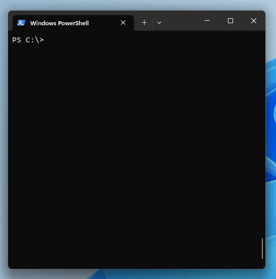
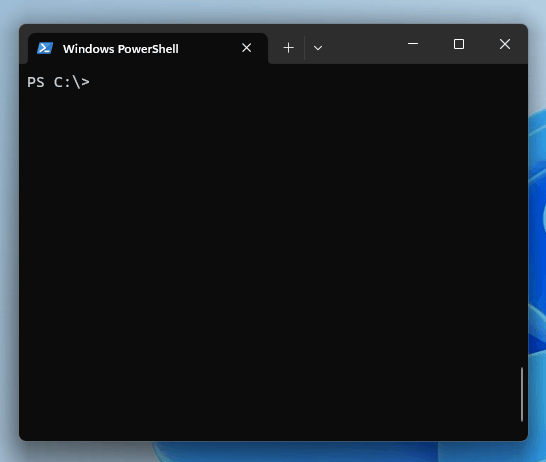

# MAC Tool

## Overview

MAC Tool is a command-line utility designed to simplify common tasks related to MAC addresses in network, security, and data scenarios. Whether you need to extract MAC addresses from text, format them differently, or look up their vendors, MAC Tool has got you covered.

MAC Tool offers versatile functionality:

- **Extraction**: You can input text directly, pipe it, or read from a file into MAC Tool, and it will efficiently extract MAC addresses from the provided content.
- **Formatting**: MAC Tool enables you to transform MAC addresses with ease. You have the flexibility to change the formatting, including altering the separator character to colons (`:`), hyphens (`-`) and periods (`.`), catering to your specific needs.
- **Vendor Lookup**: Additionally, MAC Tool empowers you to quickly retrieve vendor information associated with MAC addresses, simplifying network management and analysis tasks.

## Usage

```bash
mactool [command]
```

## Available Commands

- `extract`: Extract MAC addresses from the input string
- `format`: Change format of MAC addresses from the input string
- `info`: Print configuration and database information
- `lookup`: Lookup vendors of MAC addresses from the input string

## Flags

- `--config string` : Config file (default is $HOME/.mactool.yaml)
- `-h, --help` : Help for mactool
- `-v, --version` : Version for mactool

Use `mactool [command] --help` for more information about a specific command.

## Installation

Here's a short instruction on how to get started using the MAC Tool application by downloading the executable from its GitHub releases page and placing the file in your PATH:

1. **Download the Executable**:

   Visit the MAC Tool releases page on GitHub by following this link: [https://github.com/bitcanon/mactool/releases](https://github.com/bitcanon/mactool/releases).

2. **Choose Your Operating System**:

   On the releases page, you will find a list of available releases for various operating systems. Choose the appropriate release for your system. MAC Tool supports most operating systems, so select the one that matches your setup, such as Windows, macOS, or Linux.

3. **Download and Extract the Executable**:

   When you click on the release version to download, you will typically receive a compressed archive file (e.g., a `.zip` or `.tgz` file) that contains the MAC Tool executable. Download this compressed archive and extract the executable from it using your preferred archive utility.

4. **Place the Executable in Your PATH**:

   Once the executable is downloaded and extracted, move it to a directory that is included in your systems PATH. This ensures that you can run the `mactool` command from any location in your terminal.

5. **Verify Installation**:

   To verify that the installation was successful, open a terminal window and type:

   ```bash
   mactool --version
   ```
   If you see the version number of MAC Tool displayed in the terminal, it means the tool is installed and ready to use.

With these steps, you should now have the MAC Tool executable properly downloaded, extracted, and accessible from your terminal. Enjoy using MAC Tool for your MAC address-related tasks!

## Getting Started

Let's explore some of the common use cases for MAC Tool.

### Extract MAC Addresses

To extract MAC addresses from a text string, use the `extract` command. For example:

```bash
mactool extract "Here are some MAC addresses: 00:1A:2B:3C:4D:5E, 11-22-33-44-55-66"
```

This command will extract and display the MAC addresses found in the input string:
    
```bash
00:1A:2B:3C:4D:5E
11-22-33-44-55-66
```

Use the `extract` command in interactive mode to extract MAC addresses from a text pasted into the terminal:


For more details on the `extract` command, please refer to [Extract Command](https://github.com/bitcanon/mactool/wiki/Extract-Command) documentation.

### Format MAC Addresses

You can change the format of MAC addresses using the `format` command. For instance:

```bash
mactool format "00:1A:2B:3C:4D:5E" --delimiter="-" --lower
```

This will format the MAC address with hyphens instead of colons and in lowercase:
```bash
00-1a-2b-3c-4d-5e
```

Use the `format` command in interactive mode to format MAC addresses from a text pasted into the terminal:



For more details on the `format` command, please refer to [Format Command](https://github.com/bitcanon/mactool/wiki/Format-Command) documentation.

### Information

To get information about the configuration and database, use the `info` command. For example:

```bash
mactool info
```

This will provide you with information about the configuration variables and database information.

For more details on the `info` command, please refer to [Info Command](https://github.com/bitcanon/mactool/wiki/Info-Command) documentation.

### Lookup Vendors

To lookup vendors of MAC addresses, utilize the `lookup` command. Here's an example:

```bash
mactool lookup "Let's lookup some MACs 00:1A:2B:3C:4D:5E, 00-11-22-33-44-55, and so on..."
```

This will provide you with information about the vendor associated with the given MAC address:
```bash
00:1A:2B:3C:4D:5E (Ayecom Technology Co., Ltd.)
00-11-22-33-44-55 (CIMSYS Inc)
```

Use the `lookup` command in interactive mode to lookup MAC addresses vendors from a text pasted into the terminal:



For more details on the `lookup` command, please refer to [Lookup Command](https://github.com/bitcanon/mactool/wiki/Lookup-Command) documentation.

## Configuration

You can customize MAC Tool's behavior by using a configuration file. By default, the tool looks for a configuration file at `$HOME/.mactool.yaml`.

## License

MAC Tool is open-source software licensed under the [MIT License](LICENSE).